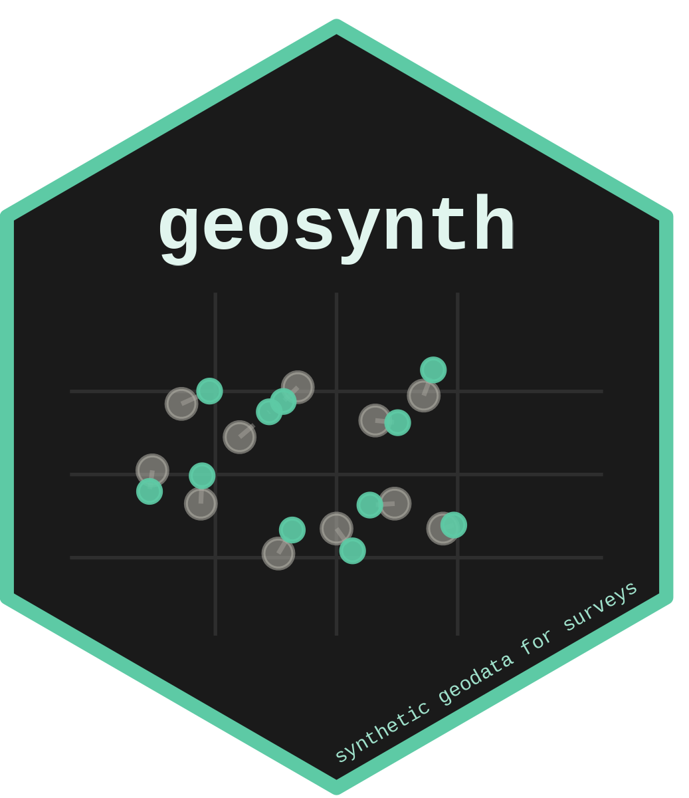

# geosynth: Synthetic Coordinates for German Survey Data 
<!-- badges: start -->
[](https://www.repostatus.org/#active)
[](https://github.com/StefanJuenger/geosynth/actions/workflows/R-CMD-check.yaml)
[](https://app.codecov.io/gh/StefanJuenger/geosynth)
[](https://choosealicense.com/licenses/mit/)
[](https://www.tidyverse.org/lifecycle/#stable)
[](/commits/master)
<!-- badges: end -->

This `R` package provides tools to create low-threshold synthetic versions of the geographic structure of German georeferenced survey data that mimic the spatial component of the original dataset without exposing confidential coordinates or survey locations. It is designed to support spatial linking workflows--such as joining survey data with contextual geographic information--by ensuring that synthetic data closely resembles the original data in its distributional and structural properties. These data enable testing, prototyping, and methodological development without accessing restricted location data.

If you want to jump right into using the `R` package, you can skip the next two sections. If you are puzzled about what we mean by georeferenced survey data, keep on reading.

## What are georeferenced survey data?

In the narrowest possible sense, georeferenced survey data are survey data that include direct spatial references in the form of geocoordinates. These geocoordinates result from geocoding survey respondents' housing addresses, but are not limited to that small spatial scale. Having such spatial information ready for spatial linkages enables avenues of social science research that exploit survey information jointly with information extracted from a multitude of attributes originating from interdisciplinary geospatial datasets. Georeferenced survey data are augmented datasets that open up opportunities--and pose challenges for social science research.

The challenges stem from the fact that spatial information can make people re-identifiable, raising serious data protection concerns. To address these concerns, research projects that handle sensitive geocoordinates usually store the geometric information and the anonymized survey data in separate, access-controlled locations. Accordingly, external researchers cannot simply click a download button to retrieve this data. Instead, research data centers--such as those at [GESIS](https://www.gesis.org)--offer secure access facilities where researchers can work with the data on-site or via a secure remote client. These facilities typically restrict access to the internet and other external resources, and researchers often encounter the data for the very first time only after entering such an environment. It is there that they must build their entire data preparation and analysis pipeline, often under tight time constraints and with little opportunity for iteration. That is part of the deal, but it can get cumbersome for everyone involved.

## What can synthetic data provide?

Synthetic georeferenced data can help break this bottleneck. By generating a dataset that mirrors the spatial structure of the original survey--in terms of municipality composition, population density weighting, and the overall geographic spread of sampling points--without retaining any actual respondent coordinates, researchers gain a freely shareable stand-in for the real data. This stand-in is not meant for substantive analysis, but it is a powerful tool for *everything that comes before* the analysis.

Concretely, synthetic data allows researchers to:

- **Develop and test spatial linking pipelines outside secure facilities.** Code that joins survey records to contextual layers--land use, noise exposure, neighborhood deprivation indices, distance to amenities, and so on--can be written, debugged, and benchmarked on synthetic coordinates before a single day of on-site access is consumed. This workflow dramatically reduces the time spent in the secure environment on purely infrastructural tasks.
- **Prototype and communicate analytical workflows.** Synthetic data can be shared with collaborators, reviewers, or students who do not hold clearance for the restricted data, making it straightforward to reproduce the analytical setup, review code, and discuss methodological choices openly. Entire reproducibility packages can be made public without any risk of disclosure.
- **Perform pre-registration and power analyses.** Because the synthetic sample respects population-weighted spatial distributions, it is a plausible input for simulation-based power calculations or sensitivity analyses that involve spatial predictors or neighborhood-level contextual variables.
- **Teach and illustrate spatial methods.** The package ships with `fake_survey_coordinates`, a built-in example dataset, so that anyone can run the full workflow without needing access to any real survey infrastructure. These data make `geosynth` useful not only for researchers with pending data access, but also for instructors and course participants who want hands-on experience with spatial linking workflows.

What synthetic data deliberately do *not* provide is any valid inference about actual respondents or their neighborhoods. The coordinates are statistically plausible but individually meaningless--they should never be treated as a substitute for real data in substantive analyses or used to draw conclusions about specific places or populations.

## Installation

You can install the development version of `geosynth` from GitHub like so:

```{r eval=FALSE}
# install.packages("pak")
pak::pkg_install("StefanJuenger/geosynth")
```

## In a nutshell

At the heart of the package are three functions:

- `geosynth::create_sample_frame()` constructs a sample frame based on municipalities and population thresholds while ensuring a minimum number of sampling points per geographic unit. It uses the regional classification `regiostar` to group municipalities and accepts a year argument to match the appropriate population data vintage.
- `geosynth::draw_sample()` selects a sample of [INSPIRE](https://inspire.ec.europa.eu/) grid cells from a pre-defined sample frame, weighting each cell by the number of inhabitants it contains according to built-in census data. This weighting ensures that densely populated areas contribute a proportionally greater number of synthetic points, closely mirroring the spatial distribution of the original survey.
- `geosynth::shuffle_min_distance()` permutes the rows of the synthetic dataset such that each synthetic point is at least a pre-defined threshold of `x` kilometers away from its corresponding point in the original dataset. This function requires access to the original geocoordinates and adds another spatial privacy layer to the synthetic sample.

## Example

This example demonstrates how to use the `geosynth` package to generate a synthetic geospatial sample frame, draw a population-weighted sample of grid cells, and ensure the synthetic coordinates maintain a minimum distance from the original data points. We'll use the internal dataset `fake_survey_coordinates` provided by the package.

### Load package and data

```{r include = FALSE}
library(sf)
library(tibble)
```


```{r}
library(geosynth)

data("fake_survey_coordinates")

fake_survey_coordinates
```

The `fake_survey_coordinates` dataset is stored as an `sf` object including geocoordinates. Geocoordinates are not strictly necessary for the first two steps of the workflow--all that is required is a column containing the municipality identifier `AGS` (Amtlicher Gemeindeschlüssel). If geocoordinates are available, they can also be used in the third step to enforce a spatial minimum distance guarantee.

### Step 1: Create a sample frame

We use `geosynth::create_sample_frame()` to define which municipalities to include, based on population thresholds and a minimum number of sampling points. The `geo_unit` argument specifies the regional classification system used to group municipalities (here: `regiostar17`, i.e., the 2017 version of the RegioStaR classification), and `year` determines which population data vintage to use for the thresholding.

```{r}
sample_frame <- 
  geosynth::create_sample_frame(
    .data = fake_survey_coordinates,
    year = "2024",
    geo_unit = "regiostar17",
    inhabitants_threshold = 10000,
    minimum_sample_points = 10
  )

sample_frame
```

The resulting `sample_frame` object defines the set of municipalities eligible for synthetic sampling. Municipalities below the population threshold are excluded; municipalities with fewer than `minimum_sample_points` respondents in the original data are also flagged. This cautious procedure ensures that the synthetic sample frame does not generate points in areas that are too sparsely represented to yield meaningful synthetic coverage.

### Step 2: Draw a population-weighted sample

Next, we draw a population-weighted sample of INSPIRE grid cells from the sample frame using `geosynth::draw_sample()`. The function uses built-in census data to assign each grid cell a sampling weight proportional to its resident population, so that densely populated cells are more likely to receive a synthetic point. The result is an `sf` object with synthetic point coordinates placed within the eligible grid cells.

```{r}
synthetic_sample <- geosynth::draw_sample(sample_frame = sample_frame)

synthetic_sample
```

At this stage, `synthetic_sample` already provides a realistic spatial footprint that can be linked to external geospatial data sources--just as one would link the real survey data during a secure-facility session. The coordinates are not tied to any actual respondent; they simply reflect where, statistically speaking, respondents of a survey with this municipality composition *could* have lived.

### Step 3: Enforce a minimum distance from original coordinates

If the researcher also has access to the original geocoordinates and wants to add another privacy safeguard, `geosynth::shuffle_min_distance()` can be used to permute the rows of the synthetic dataset so that no synthetic point is closer than a chosen distance threshold to its matched counterpart in the original dataset. This additional privacy layer is particularly useful when the synthetic data will be shared in contexts where residual spatial proximity to real respondents might still pose a re-identification risk.

```{r}
synthetic_shuffled <-
  geosynth::shuffle_min_distance(
    synthetic_data = synthetic_sample,
    original_data = fake_survey_coordinates,
    min_km = 50
  )

synthetic_shuffled
```

The resulting object is a shuffled `sf` dataset in which every synthetic coordinate is at least 5 km from the original respondent location it was matched to. Note that this step requires the original geocoordinates and should therefore be executed only within a secure environment; the shuffled output can then be exported for use outside.

## Citation

If you use `geosynth` in your research, please cite the package directly. You can obtain a ready-to-use citation by running:

```{r eval=FALSE}
citation("geosynth")
```

Until a dedicated publication for `geosynth` is available, the suggested citation is:

> Jünger, Stefan (`r format(Sys.Date(), "%Y")`). *geosynth: Creating Synthetic Georeferenced Data* (R package version 0.1.0). GESIS -- Leibniz Institute for the Social Sciences. https://github.com/StefanJuenger/geosynth

In BibTeX format:

```bibtex
@Manual{geosynth,
  title  = {geosynth: Creating Synthetic Georeferenced Data},
  author = {Stefan Jünger},
  year   = {2025},
  note   = {R package version 0.1.0},
  url    = {https://github.com/StefanJuenger/geosynth},
}
```

The `geosynth` package was developed in the context of work on georeferenced survey data at GESIS. For the broader methodological background on spatial linking of survey data that motivates this package, you may also want to consult:

- Jünger, Stefan (2019). *Using Georeferenced Data in Social Science Survey Research: The Method of Spatial Linking and Its Application with the German General Social Survey and the GESIS Panel.* GESIS-Schriftenreihe, 24. GESIS -- Leibniz Institute for the Social Sciences. https://doi.org/10.21241/ssoar.65343
- Bensmann, Felix, Lars Heling, Stefan Jünger, et al. (2020). An Infrastructure for Spatial Linking of Survey Data. *Data Science Journal*, 19(1), 27. https://doi.org/10.5334/dsj-2020-027
- Jünger, Stefan, Jan Philipp Kolb, and Maikel Schwerdtfeger (2020). *Georeferencing the GESIS Panel: Background, Workflow, and Analysis Example.* GESIS Papers, 2020|10. https://doi.org/10.21241/ssoar.69336
